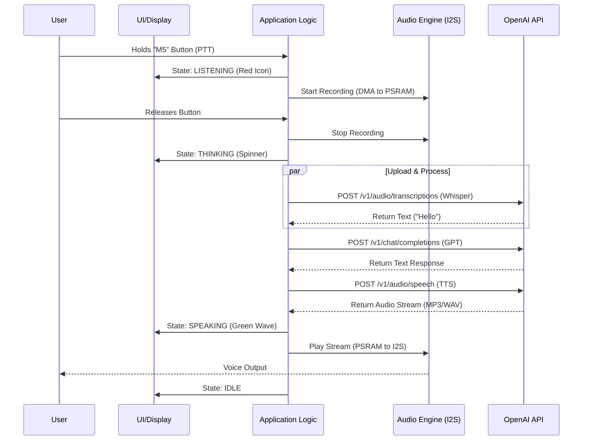

# Chapter 1: Introduction & Architecture

## 1.1 Project Overview
This document outlines the development lifecycle for a **Voice-Enabled AI Assistant** designed for children. The system utilizes the **M5StickC S3** hardware platform to provide a "Push-to-Talk" (PTT) interface that captures user speech, processes it via cloud-based Large Language Models (OpenAI), and returns a synthesized voice response.

The project prioritizes low latency, high audio intelligibility, and secure connectivity, leveraging the specific hardware acceleration capabilities of the ESP32-S3 System-on-Chip (SoC).

## 1.2 Design Philosophy
To ensure scalability and maintainability, the firmware adheres to the following engineering principles:

1.  **Hardware Abstraction:** Application logic is decoupled from physical pin definitions using the **M5Unified** Hardware Abstraction Layer (HAL). This allows for future hardware revisions without rewriting business logic.
2.  **Asynchronous Concurrency:** The system utilizes **FreeRTOS** to manage audio buffering, network transmission, and UI updates in parallel, preventing "blocking" states during API latency.
3.  **Resource Optimization:** The architecture explicitly manages the **8MB PSRAM** for high-bandwidth audio buffers, reserving internal SRAM for the Wi-Fi stack and SSL encryption contexts.

## 1.3 The System Stack
The system is organized into a five-layer architecture, moving from the physical silicon to the user experience.

| Layer | Name | Function | Specific Implementation |
| :--- | :--- | :--- | :--- |
| **L5** | **Application** | User Interface & Business Logic | PTT State Machine, Persona Logic, Error Handling. |
| **L4** | **Connectivity** | Cloud Integration | OpenAI API (Whisper/GPT/TTS), HTTPS/TLS 1.2+, JSON Serialization. |
| **L3** | **Middleware** | OS & Task Management | **FreeRTOS** (Tasks/Queues), Ring Buffers for Audio. |
| **L2** | **Abstraction** | Hardware Drivers | **M5Unified** (Board Init), **M5GFX** (Display), **ESP-IDF** (Wi-Fi/SSL). |
| **L1** | **Physical** | Silicon & Peripherals | **ESP32-S3** (SoC), **ES8311** (Codec), **AW8737** (Amp), **AXP2101** (PMU). |

## 1.4 Hardware Architecture (The "Iron")
The **M5StickC S3** was selected as the target hardware due to specific architectural advantages over previous generations (StickC/Plus).

### 1.4.1 The Compute Core (ESP32-S3)
*   **Vector Instructions (SIMD):** The Xtensa LX7 dual-core CPU includes vector instructions that accelerate the mathematical operations required for SSL/TLS handshakes and audio compression.
*   **Octal SPI (OPI) Interface:** Provides a high-speed data lane between the CPU and the 8MB PSRAM, essential for recording audio without "glitching" while simultaneously handling Wi-Fi traffic.

### 1.4.2 The Audio Subsystem
Unlike the "Plus" variants which rely on simple buzzers or PWM audio, the StickS3 features a dedicated I2S audio pipeline:
*   **Input:** MEMS Microphone (PDM/I2S interface).
*   **Processing:** **ES8311** Audio Codec (Handles Analog-to-Digital conversion and gain control).
*   **Output:** **AW8737** Class-D Amplifier driving an internal speaker.

## 1.5 Data Flow Architecture
The following diagram illustrates the lifecycle of a single user interaction ("The Chat Loop").

## 1.6 Development Environment Strategy
To balance rapid prototyping with production performance, a hybrid workflow is defined:

1.  **Phase A (Verification):** Use **UiFlow 2.0** (Web IDE) for immediate hardware validation (Mic/Speaker tests) and asset management.
2.  **Phase B (Simulation):** Use **PlatformIO Native** builds with hardware mocking to test API integration and JSON parsing logic on a host PC.
3.  **Phase C (Production):** Use **VS Code + PlatformIO** (C++ framework) for the final firmware, enabling direct memory access (DMA) and deep power management control.
