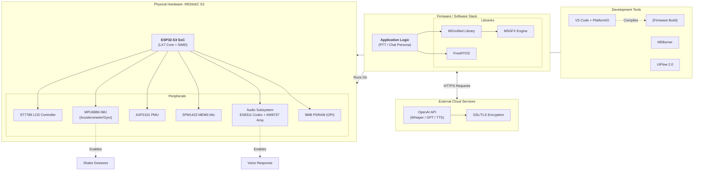

# Chapter 2: System Entities & Design Rationale

## 2.1 Hardware Entities (The Physical Layer)
The selection of the **M5StickC S3** was driven by the strict requirement for high-fidelity audio processing in a compact form factor suitable for children.

*   **M5StickC S3:** The target hardware platform.
    *   *Motivation:* Unlike the "Plus" or "C" variants, the S3 includes a dedicated audio amplifier and codec, making it the only "Stick" capable of clear voice playback without external peripherals.
*   **ESP32-S3 SoC:** The central processing unit.
    *   *Motivation:* Selected for its **Xtensa LX7** core with **SIMD (Vector Instructions)**. This architecture accelerates SSL/TLS handshakes by ~40% compared to older ESP32 chips, reducing the "thinking time" latency when connecting to OpenAI.
*   **PSRAM (8MB) via Octal SPI (OPI):** External Random Access Memory.
    *   *Motivation:* Audio recording is memory-intensive. A 5-second clip at 16kHz/16-bit requires ~160KB of buffer. The **OPI** interface ensures this data moves from the microphone to RAM fast enough to prevent audio "glitching" while the Wi-Fi stack is active.
*   **ES8311 (Codec) & AW8737 (Amp):** The audio pipeline chips.
    *   *Motivation:* These provide hardware-level gain control and amplification, superior to the PWM-based "buzzers" found in cheaper boards.
*   **AXP2101 (PMU):** Power Management Unit.
    *   *Motivation:* Critical for battery health. It allows the software to monitor voltage and safely shut down the device to prevent LiPo damage, a necessary safety feature for a kid's toy.

## 2.2 Software Development Platforms
A hybrid approach was chosen to balance ease of testing with production performance.

*   **PlatformIO (VS Code Extension):** The primary production environment.
    *   *Motivation:* Offers superior dependency management (`platformio.ini`) and C++ intellisense compared to the standard Arduino IDE. It allows for "Native" builds to test logic on a PC.
*   **Arduino Framework:** The core software abstraction.
    *   *Motivation:* Provides a massive ecosystem of existing libraries (HTTPClient, WiFi) that drastically reduces development time compared to raw ESP-IDF.
*   **UiFlow 2.0 (MicroPython):** The hardware verification tool.
    *   *Motivation:* Used strictly for "Phase 0" testing (e.g., "Is the microphone soldered correctly?") because it requires no compilation time.

## 2.3 Libraries & Frameworks
*   **M5Unified:** The hardware abstraction library.
    *   *Motivation:* It unifies the API. If M5Stack releases a "StickC S4" next year, code written with M5Unified will likely work with zero changes.
*   **FreeRTOS:** The Real-Time Operating System.
    *   *Motivation:* Mandatory for concurrency. It allows the "UI Task" to animate the screen while the "Network Task" waits for OpenAI, ensuring the device never looks "frozen."
*   **SDL2:** Simple DirectMedia Layer (for PC Emulation).
    *   *Motivation:* Allows the M5GFX display library to open a window on a Windows/Mac desktop, enabling UI development without flashing the physical device.

## 2.4 External APIs & Services
*   **OpenAI API (Whisper, GPT, TTS):** The intelligence backend.
    *   *Motivation:* Provides the highest accuracy Speech-to-Text (Whisper) for child speech patterns, which are often difficult for simpler models to understand.
*   **SSL/TLS:** Secure Sockets Layer.
    *   *Motivation:* Non-negotiable requirement for communicating with `api.openai.com`. The ESP32-S3's hardware crypto accelerators make this feasible on an embedded device.

## 2.5 Tools & Utilities
*   **M5Burner:** Firmware management tool.
    *   *Motivation:* The safest way to restore the device to factory settings if a bad code upload causes a boot loop.
*   **CH9102 Driver:** USB-to-Serial Bridge driver.
    *   *Motivation:* Required for the OS to recognize the StickS3's specific USB interface.
*   **Wireshark:** Network protocol analyzer.
    *   *Motivation:* Essential for debugging API failures (e.g., verifying if the JSON payload sent to OpenAI is formatted correctly).

---

## 2.6 Entity Dependency Diagram

The following diagram visualizes how these entities rely on one another. The **Application Logic** sits at the top, relying on the **Software Stack**, which controls the **Hardware**, all while communicating with **External Services**.

