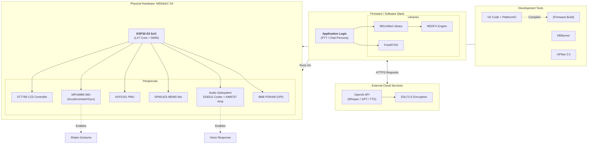

# Chapter 2: System Entities & Design Rationale

## 2.1 Hardware Entities (The Physical Layer)
The selection of the **M5StickC S3** was driven by the strict requirement for high-fidelity audio processing in a compact form factor suitable for children.

*   <a id="m5stickc-s3"></a>**M5StickC S3:** The target hardware platform.
    *   *Motivation:* Unlike the "Plus" or "C" variants, the S3 includes a dedicated audio amplifier and codec, making it the only "Stick" capable of clear voice playback without external peripherals.
*   <a id="esp32-s3-soc"></a>**ESP32-S3 SoC:** The central processing unit (ESP32-S3-PICO-1-N8R8).
    *   *Motivation:* Selected for its **Xtensa LX7** core with **SIMD (Vector Instructions)**. This architecture accelerates SSL/TLS handshakes by ~40% compared to older ESP32 chips, reducing the "thinking time" latency when connecting to OpenAI.
*   <a id="psram"></a>**PSRAM (8MB):** External Random Access Memory via **Octal SPI (OPI)**.
    *   *Motivation:* Audio recording is memory-intensive. A 5-second clip at 16kHz/16-bit requires ~160KB of buffer. The **OPI** interface ensures this data moves from the microphone to RAM fast enough to prevent audio "glitching" while the Wi-Fi stack is active.
*   <a id="es8311"></a>**ES8311:** The I2S Audio Codec chip.
    *   *Motivation:* Handles the Analog-to-Digital (ADC) and Digital-to-Analog (DAC) conversion. It provides hardware-level gain control, superior to the software-only gain found in cheaper boards.
*   <a id="aw8737"></a>**AW8737:** The Class-D Audio Amplifier.
    *   *Motivation:* Drives the internal speaker efficiently. It is specifically tuned to prevent distortion at the high volumes needed for a child to hear the response.
*   <a id="spm1423"></a>**SPM1423 (MEMS Mic):** The digital PDM microphone.
    *   *Motivation:* A digital interface microphone is less susceptible to electrical noise (interference) from the Wi-Fi antenna than an analog microphone.
*   <a id="axp2101"></a>**AXP2101 (PMU):** Power Management Unit.
    *   *Motivation:* Critical for battery health. It allows the software to monitor voltage and safely shut down the device to prevent LiPo damage. *Note: This replaces the AXP192 found in older models.*
*   <a id="mpu6886"></a>**MPU6886 (IMU):** 6-Axis Inertial Measurement Unit (Gyroscope + Accelerometer).
    *   *Motivation:* Enables gesture-based controls (e.g., "Shake to Cancel" recording), adding a tactile interaction layer suitable for children.
*   <a id="st7789"></a>**ST7789:** The LCD Display Controller.
    *   *Motivation:* Drives the 0.85-inch screen. It is a standard, low-power driver fully supported by the graphics engine.

## 2.2 Software Development Platforms
A hybrid approach was chosen to balance ease of testing with production performance.

*   <a id="platformio"></a>**PlatformIO:** The primary production environment (VS Code Extension).
    *   *Motivation:* Offers superior dependency management (`platformio.ini`) and C++ intellisense compared to the standard Arduino IDE. It allows for "Native" builds to test logic on a PC.
*   <a id="arduino-framework"></a>**Arduino Framework:** The core software abstraction layer.
    *   *Motivation:* Provides a massive ecosystem of existing libraries (HTTPClient, WiFi) that drastically reduces development time compared to raw ESP-IDF.
*   <a id="esp-idf"></a>**ESP-IDF:** The native Espressif IoT Development Framework.
    *   *Motivation:* The underlying foundation of the Arduino framework. We may access low-level IDF functions directly for advanced power management features.
*   <a id="uiflow-2"></a>**UiFlow 2.0:** The hardware verification tool (MicroPython).
    *   *Motivation:* Used strictly for "Phase 0" testing (e.g., "Is the microphone soldered correctly?") because it requires no compilation time.

## 2.3 Libraries & Frameworks
*   <a id="m5unified"></a>**M5Unified:** The hardware abstraction library.
    *   *Motivation:* It unifies the API. It automatically detects the [AXP2101](#axp2101) vs older PMUs, ensuring code portability across hardware revisions.
*   <a id="m5gfx"></a>**M5GFX:** The graphics engine.
    *   *Motivation:* Handles screen drawing on the [ST7789](#st7789). It supports efficient DMA transfers to update the screen without blocking the audio thread.
*   <a id="freertos"></a>**FreeRTOS:** The Real-Time Operating System.
    *   *Motivation:* Mandatory for concurrency. It allows the "UI Task" to animate the screen while the "Network Task" waits for OpenAI, ensuring the device never looks "frozen."
*   <a id="sdl2"></a>**SDL2:** Simple DirectMedia Layer (for PC Emulation).
    *   *Motivation:* Allows the [M5GFX](#m5gfx) display library to open a window on a Windows/Mac desktop, enabling UI development without flashing the physical device.

## 2.4 External APIs & Services
*   <a id="openai-api"></a>**OpenAI API:** The intelligence backend (Whisper, GPT, TTS).
    *   *Motivation:* Provides the highest accuracy Speech-to-Text (Whisper) for child speech patterns, which are often difficult for simpler models to understand.
*   <a id="ssl-tls"></a>**SSL/TLS:** Secure Sockets Layer encryption.
    *   *Motivation:* Non-negotiable requirement for communicating with `api.openai.com`. The [ESP32-S3](#esp32-s3-soc) hardware crypto accelerators make this feasible on an embedded device.

## 2.5 Tools & Utilities
*   <a id="m5burner"></a>**M5Burner:** Firmware management tool.
    *   *Motivation:* The safest way to restore the device to factory settings if a bad code upload causes a boot loop.
*   <a id="ch9102"></a>**CH9102 Driver:** USB-to-Serial Bridge driver.
    *   *Motivation:* Required for the OS to recognize the StickS3's specific USB interface.
*   <a id="wokwi"></a>**Wokwi:** Browser-based ESP32 simulator.
    *   *Motivation:* Allows for testing Wi-Fi logic and basic IO without physical hardware access.
*   <a id="wireshark"></a>**Wireshark:** Network protocol analyzer.
    *   *Motivation:* Essential for debugging API failures (e.g., verifying if the JSON payload sent to OpenAI is formatted correctly).

## 2.6 Development Concepts
*   <a id="ptt"></a>**PTT (Push-to-Talk):** User Interface logic.
    *   *Motivation:* A simple "Hold to Record, Release to Send" mechanic is intuitive for children and saves battery compared to "Always Listening" wake-word detection.
*   <a id="dma"></a>**DMA (Direct Memory Access):** Memory transfer technique.
    *   *Motivation:* Allows audio data to move from the [ES8311](#es8311) to [PSRAM](#psram) without taxing the CPU, preventing audio stuttering.
*   <a id="simd"></a>**SIMD (Single Instruction, Multiple Data):** CPU instruction set.
    *   *Motivation:* Used by the [ESP32-S3](#esp32-s3-soc) to perform complex math on multiple data points simultaneously, speeding up AI and Encryption tasks.
*   <a id="root-ca"></a>**Root CA Certificate:** Security credential.
    *   *Motivation:* The "Key" required for the ESP32 to trust the OpenAI server during the [SSL/TLS](#ssl-tls) handshake.
*   <a id="native-emulation"></a>**Native Emulation:** Testing strategy.
    *   *Motivation:* Compiling C++ code to run on a PC (Windows/Mac) to debug logic faster than flashing hardware.

---

## 2.7 Entity Dependency Diagram

```mermaid
graph TD
    %% Subgraph for External Cloud Services
    subgraph Cloud_Services [External Cloud Services]
        OpenAI[OpenAI API<br/>(Whisper / GPT / TTS)]
        SSL[SSL/TLS Encryption]
        OpenAI --> SSL
    end

    %% Subgraph for Development Tools
    subgraph Dev_Tools [Development Tools]
        VSCode[VS Code + PlatformIO]
        M5Burner[M5Burner]
        UiFlow[UiFlow 2.0]
        
        VSCode -.->|Compiles| Firmware
    end

    %% Subgraph for The Firmware Stack
    subgraph Firmware_Stack [Firmware / Software Stack]
        AppLogic[<b>Application Logic</b><br/>(PTT / Chat Persona)]
        
        subgraph Libraries
            M5Unified[M5Unified Library]
            M5GFX[M5GFX Engine]
            FreeRTOS[FreeRTOS]
        end
        
        AppLogic --> M5Unified
        AppLogic --> FreeRTOS
        M5Unified --> M5GFX
    end

    %% Subgraph for Physical Hardware
    subgraph Hardware [Physical Hardware: M5StickC S3]
        ESP32S3[<b>ESP32-S3 SoC</b><br/>(LX7 Core + SIMD)]
        
        subgraph Peripherals
            PSRAM[8MB PSRAM (OPI)]
            Audio[Audio Subsystem<br/>ES8311 Codec + AW8737 Amp]
            Mic[SPM1423 MEMS Mic]
            PMU[AXP2101 PMU]
            IMU[MPU6886 IMU<br/>(Accelerometer/Gyro)]
            Screen[ST7789 LCD Controller]
        end
        
        ESP32S3 --> PSRAM
        ESP32S3 --> Audio
        ESP32S3 --> Mic
        ESP32S3 --> PMU
        ESP32S3 --> IMU
        ESP32S3 --> Screen
    end

    %% Relationships
    Firmware_Stack -->|Runs On| Hardware
    Firmware_Stack <-->|HTTPS Requests| Cloud_Services
    Dev_Tools -->|Flashes via USB| Hardware
    
    %% Feature Mapping
    IMU -.->|Enables| Shake_Gestures
    Audio -.->|Enables| Voice_Response
```

## 2.6 Entity Dependency Diagram

The following diagram visualizes how these entities rely on one another. The **Application Logic** sits at the top, relying on the **Software Stack**, which controls the **Hardware**, all while communicating with **External Services**.


