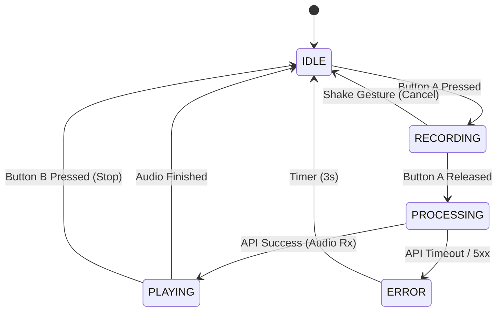

# Chapter 4: Core Application Logic

## 4.1 The Finite State Machine (FSM)
The central nervous system of the application is a **Finite State Machine**. Given the single-threaded nature of the user interaction (you cannot speak and listen simultaneously), an FSM ensures the device is never in an undefined state.

The system defines five exclusive states:

1.  **IDLE:** Deep sleep or low-power wait loop. Screen is dimmed.
2.  **RECORDING:** [PTT](#ptt) button is held. [Mic](#spm1423) is active. Audio is writing to [PSRAM](#psram).
3.  **PROCESSING:** Audio is being uploaded to [OpenAI](#openai-api). Waiting for response.
4.  **PLAYING:** TTS Audio is streaming from Wi-Fi to the [Speaker](#aw8737).
5.  **ERROR:** Network timeout or API failure. Visual feedback provided.

### 4.1.1 State Transition Diagram


## 4.2 Task Architecture (FreeRTOS)
To prevent audio stuttering during network operations, the application utilizes **FreeRTOS** to split the workload into three concurrent tasks.

| Task Name | Priority | Core | Responsibility |
| :--- | :--- | :--- | :--- |
| **UI_Task** | Low (1) | 1 | Handles Button debouncing, [IMU](#mpu6886) gestures, and [Screen](#st7789) animations. |
| **Net_Task** | Medium (5) | 0 | Manages Wi-Fi stack, [SSL](#ssl-tls) encryption, and HTTP requests. |
| **Audio_Task** | High (10) | 1 | Moves data between [I2S](#es8311) and [PSRAM](#psram) via [DMA](#dma). |

> **Design Note:** The `Audio_Task` is pinned to Core 1 (Application Core) to avoid contention with the Wi-Fi interrupts which natively run on Core 0 (Protocol Core).

## 4.3 Audio Pipeline Implementation
The most critical logic component is the "Audio Pipeline," which manages the flow of PCM data.

### 4.3.1 Recording Logic (The Ring Buffer)
We cannot upload audio to OpenAI in real-time (streaming upload) due to SSL handshake latency. Instead, we use a **Store-and-Forward** architecture.

1.  **Allocation:** On boot, allocate a static `uint8_t` buffer of 512KB in [PSRAM](#psram).
2.  **Capture:** When `RECORDING` state enters:
    *   Initialize [I2S](#es8311) at 16kHz, 16-bit Mono.
    *   Use `M5.Mic.record()` to fill the buffer via [DMA](#dma).
3.  **Limit:** Enforce a hard limit of 15 seconds (approx 480KB) to prevent buffer overflow.

### 4.3.2 Playback Logic (Streaming)
Unlike recording, playback *is* streamed to reduce latency.
1.  **Header Parsing:** The [Net_Task](#freertos) strips the HTTP headers from the OpenAI TTS response.
2.  **Buffering:** Raw MP3/WAV bytes are fed into a small Ring Buffer (16KB).
3.  **Decoding:** An MP3 decoder (software library) converts frames to PCM.
4.  **Output:** The `Audio_Task` feeds PCM data to the [AW8737](#aw8737) amplifier.

## 4.4 Input Handling Strategy

### 4.4.1 Push-to-Talk (PTT) Debouncing
Using [M5Unified](#m5unified), we implement robust button logic to prevent accidental triggers.

```cpp
void update_buttons() {
    M5.update(); // Read hardware pins
    
    // Debounce: Only trigger if held for > 100ms
    if (M5.BtnA.pressedFor(100)) {
        changeState(RECORDING);
    }
    
    // Release: Trigger upload
    if (M5.BtnA.wasReleased()) {
        changeState(PROCESSING);
    }
}
```

### 4.4.2 Gesture Control (Shake-to-Cancel)
Children often start recording and realize they made a mistake. Instead of sending bad audio, we use the [MPU6886](#mpu6886) IMU.

*   **Logic:** Calculate the total acceleration vector `|a| = sqrt(x² + y² + z²)`.
*   **Threshold:** If `|a| > 2.5G` while in `RECORDING` state:
    1.  Discard the audio buffer.
    2.  Play a "Whoosh" sound.
    3.  Return to `IDLE`.

## 4.5 Visual Feedback Logic
The screen provides immediate feedback to bridge the gap between action and AI response.

*   **IDLE:** Show a static "Robot Face" (Eyes Open).
*   **RECORDING:** Change background to **RED**. Animate the mouth based on microphone amplitude (Volume Meter).
*   **PROCESSING:** Change background to **BLUE**. Show a spinning loading animation. *Crucial: This confirms to the user that the device hasn't crashed.*
*   **PLAYING:** Change background to **GREEN**. Animate mouth based on speaker output amplitude.

## 4.6 Error Recovery Logic
Embedded devices must be resilient. The logic handles three specific failure modes:

1.  **No Audio Detected:** If the user presses the button but the RMS amplitude of the recording is near zero (silence), do not upload. Play a "Question Mark" sound and return to IDLE.
2.  **Wi-Fi Loss:** If `WiFi.status() != WL_CONNECTED` during `PROCESSING`, attempt one reconnection. If it fails, show "No Wi-Fi" icon.
3.  **API Error:** If OpenAI returns HTTP 401 (Unauthorized) or 429 (Rate Limit), display a specific error code on screen for the parent to debug.
